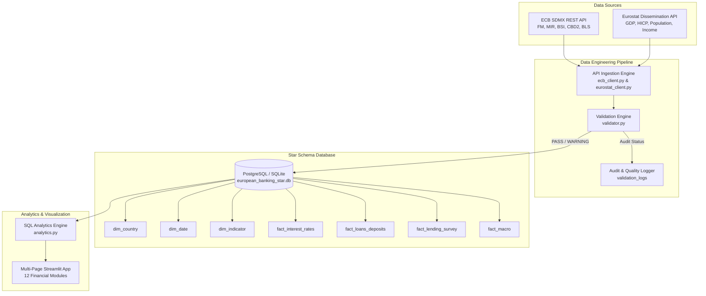

# 🏦 European Banking Analytics

A production-grade, European-first **Data Engineering & Financial Analytics Platform** designed to ingest, validate, model, analyze, and visualize banking sector performance, commercial interest rates, balance sheet aggregates, risk indicators, and monetary policy transmission across **27+ European economies**.

Built strictly with **REAL official APIs** from the **European Central Bank (ECB)** and **Eurostat**, the platform provides an interactive 12-page Streamlit analytical dashboard backed by a dimensional Star-Schema database and an automated Pydantic validation engine.

---

## 🚀 Live Demo
🔗 **Public Application URL:** [https://european-banking-analytics.onrender.com](https://european-banking-analytics.onrender.com)

---

## 🌟 Key Highlights & Engineering Features

- **🇪🇺 European-First Analytics**: Comprehensive cross-country comparison across Euro Area and EU member states categorized into official UN/Eurostat regional groupings (*Western, Southern, Northern, Eastern Europe*).
- **📡 Pure Official API Ingestion**: Direct integration with ECB SDMX REST API (`FM`, `MIR`, `BSI`, `CBD2`, `BLS`) and Eurostat Dissemination API (`nama_10_gdp`, `nama_10_pc`, `demo_gind`, `prc_hicp_manr`, `nasq_10_nf_tr`). Zero hardcoded economic values or third-party datasets.
- **⭐ Dimensional Star Schema**: Relational database architecture featuring `dim_country`, `dim_date`, `dim_indicator`, `dim_source`, and 5 dedicated fact tables storing `39,330+` verified observations.
- **🛡️ Automated Data Quality Engine**: Rule-based validation storing audit status logs (`PASS`, `FAIL`, `WARNING`, `UNVERIFIED`) covering PK/FK integrity, duplicate detection, and bounds testing (allowing legitimate negative interest rates/inflation).
- **📊 12-Page Streamlit Dashboard**: Financial analytical interface offering mortgage/corporate rate spreads over ECB policy rates, Loan-to-Deposit Ratios (LDR), credit growth, banking profitability (ROE/ROA), and single-country deep dives.

---

## 🏗️ System Architecture



---

## 📊 Database Star Schema Architecture

```
               +------------------+
               |   dim_country    |
               +------------------+
               | country_code (PK)|
               | country_name     |
               | region           |
               | is_ea / is_eu    |
               +--------+---------+
                        |
                        | 1:N
   +--------------------+--------------------+
   |                    |                    |
+--v-----------------+ +v-------------------+ +v-------------------+
|fact_interest_rates | |fact_loans_deposits | |    fact_macro      |
+--------------------+ +--------------------+ +--------------------+
| fact_id (PK)       | | fact_id (PK)       | | fact_id (PK)       |
| country_code (FK)  | | country_code (FK)  | | country_code (FK)  |
| indicator_code (FK)| | indicator_code (FK)| | indicator_code (FK)|
| date_key (FK)      | | date_key (FK)      | | date_key (FK)      |
| obs_value          | | obs_value          | | obs_value          |
+--+-----------------+ +v-------------------+ ++-------------------+
   |                    |                    |
   +--------------------+--------------------+
                        |
               +--------v---------+
               |  dim_indicator   |
               +------------------+
               |indicator_code(PK)|
               |indicator_name    |
               |category          |
               |unit / frequency  |
               +------------------+
```

---

## 📡 Official Series Catalog Matrix

Every metric is fully traceable to its official source dataset and series key. Detailed metadata is documented in [docs/series_catalog.md](file:///Users/andreastsakiris/European-Banking-Analytics/docs/series_catalog.md).

| Category | Indicator Name | Exact Series Key / Query | Source | Freq | Unit |
|---|---|---|---|---|---|
| Monetary Policy | Deposit Facility Rate | `FM.B.U2.EUR.4F.KR.DFR.LEV` | ECB Data API | Daily (B) | % p.a. |
| Monetary Policy | Main Refinancing Rate | `FM.B.U2.EUR.4F.KR.MRR_FR.LEV` | ECB Data API | Daily (B) | % p.a. |
| Interest Rates | Mortgage Lending Rate | `MIR.M.<GEO>.B.A2C.A.R.A.2250.EUR.N` | ECB Data API | Monthly (M) | % p.a. |
| Interest Rates | Corporate Lending Rate | `MIR.M.<GEO>.B.A2B.A.R.A.2250.EUR.N` | ECB Data API | Monthly (M) | % p.a. |
| Interest Rates | Household Deposit Rate | `MIR.M.<GEO>.B.L21.A.R.A.2250.EUR.N` | ECB Data API | Monthly (M) | % p.a. |
| Loans & Credit | Housing Loans Stock | `BSI.M.<GEO>.Y.U.A20.A.1.U2.2250.Z01.E` | ECB Data API | Monthly (M) | EUR Million |
| Loans & Credit | Corporate Loans Stock | `BSI.M.<GEO>.Y.U.A22.A.1.U2.2250.Z01.E` | ECB Data API | Monthly (M) | EUR Million |
| Lending Survey | Credit Standards Net % | `BLS.Q.<GEO>.ALL.BC.E.LE.B3.ST.S.FNET` | ECB Data API | Quarterly (Q) | Net % |
| Macroeconomics | Gross Domestic Product | `nama_10_gdp?unit=CP_MEUR&na_item=B1GQ` | Eurostat API | Annual (A) | EUR Million |
| Macroeconomics | HICP Monthly Inflation | `prc_hicp_manr?coicop=CP00` | Eurostat API | Monthly (M) | % Change |

---

## 🖥️ Streamlit Dashboard Modules

The interactive Streamlit application contains **12 specialized pages**:

1. **Overview**: Executive European snapshot, ECB policy rate cards, weighted/simple averages.
2. **Country Comparison**: Sortable multi-country matrix and scatter analysis (Mortgage Rate vs Inflation).
3. **Interest Rates**: Commercial mortgage, corporate lending, and deposit rate trends.
4. **Loans & Credit**: Outstanding credit stocks, YoY growth rates, loans % of GDP.
5. **Deposits**: Household & corporate deposits, growth rates, deposits % of GDP.
6. **Loans vs Deposits**: Structural liquidity and Loan-to-Deposit Ratio (LDR) analysis.
7. **Banking Profitability**: Consolidated banking sector Return on Equity (ROE) & Return on Assets (ROA).
8. **Banking Risk**: Non-Performing Loans (NPL) ratios, CET1 capital adequacy, and solvency.
9. **Lending Conditions**: Bank Lending Survey (BLS) net percentage credit standard tightening.
10. **Monetary Policy**: Commercial rate spreads over ECB Deposit Facility Rate (basis points).
11. **Country Analysis**: Deep-dive single country profile for any selected European nation.
12. **Data Quality & Sources**: Complete data auditability, validation logs, and API metadata.

---

## 🚀 Quickstart & Reproducibility

### Local Setup

```bash
# 1. Clone workspace
cd European-Banking-Analytics

# 2. Install dependencies
pip install -r requirements.txt

# 3. Run full ETL pipeline (Ingests ECB & Eurostat into Star Schema DB)
python3 pipelines/run_etl.py

# 4. Launch Streamlit Dashboard
streamlit run dashboard/app.py
```

### Docker Deployment

```bash
# Spin up PostgreSQL & Streamlit dashboard with Docker Compose
docker-compose up --build
```

---

## 🧪 Automated Testing

Run the automated pytest test suite covering ETL extraction, validation rules, Star Schema persistence, and analytical queries:

```bash
python3 -m pytest tests/ -v
```

Output:
```
tests/test_etl_and_analytics.py::test_country_config_integrity PASSED    [ 20%]
tests/test_etl_and_analytics.py::test_data_dictionary_completeness PASSED [ 40%]
tests/test_etl_and_analytics.py::test_validator_engine PASSED            [ 60%]
tests/test_etl_and_analytics.py::test_star_schema_db_manager PASSED      [ 80%]
tests/test_etl_and_analytics.py::test_analytics_engine PASSED            [100%]
============================== 5 passed in 0.51s ===============================
```

---

## 📁 Repository Structure

```
European-Banking-Analytics/
├── config/
│   ├── countries.py           # European country dimension & UN/Eurostat regional definitions
│   └── data_dictionary.py     # Dataset metadata, indicator mapping, and series key templates
├── sql/
│   ├── schema.sql             # Relational Star Schema DDL
│   └── analytics.py          # Analytical SQL queries (LDR, rate spreads, snapshots)
├── etl/
│   ├── db_manager.py          # Database connection, dimension seeding & batch upsert manager
│   ├── ecb_ingestion.py       # ECB SDMX REST API ingestion client
│   └── eurostat_ingestion.py  # Eurostat Dissemination API ingestion client
├── validation/
│   └── validator.py           # Pydantic validation & automated quality check engine
├── pipelines/
│   └── run_etl.py             # Orchestrator running end-to-end ETL
├── dashboard/
│   ├── app.py                 # Streamlit entrypoint & executive landing page
│   └── pages/                 # 12 Specialized Streamlit analytical page modules
├── tests/
│   ├── test_api_ingestion.py  # Live API connectivity & parsing tests
│   └── test_etl_and_analytics.py # Full ETL, schema, validation & analytical unit tests
├── docs/
│   └── series_catalog.md      # Official series catalog documentation
├── requirements.txt
├── docker-compose.yml
├── .env.example
└── README.md
```

---

## 📜 License & Data Attribution

Data provided by the **European Central Bank (ECB)** under the [ECB Open Data License](https://www.ecb.europa.eu/services/terms/html/index.en.html) and **Eurostat** under the [Eurostat Reuse Policy](https://ec.europa.eu/eurostat/about-us/policies/copyright).
